# Final result

https://github.com/user-attachments/assets/c1ca2f6a-e57c-483e-b28c-5d5b4c6f7713

# Setup scene with 3D primitives to experiment with Colliders and Rigidbodies

Create a new 3D project or a new scene in an already existing one. Add a Plane to the scene (right click in the Hierarchy window and from the context menu choose 3D Object  $\rightarrow$  Plane or from the GameObject menu choose 3D Object  $\rightarrow$  Plane. Select the Plane and in the Inspector window set the X, Y and Z values for Position to 0 and change the Scale along all axes to 2. Check the Static check box (this tells Unity that this object will not be changed during runtime).

Then add a Box Collider component to the plane – with the Plane selected press the Add Component button at the bottom of the Inspector window, type box in the search field and select Box Collider.

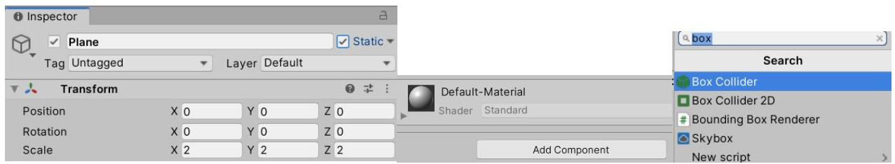
Figure 1. Set Position to 0 and Scale to 2 along X, Y and Z and add a Box Collider Component to the Plane

Note: A Collider component helps detect collisions and ray-intersections. An object without a Collider component cannot detect collisions and ray-intersections. Unity's documentation on colliders: https://docs.unity3d.com/Manual/CollidersOverview.html https://docs.unity3d.com/ScriptReference/Collider..

Next we'll add two cubes and a sphere to experiment a bit with the Collider and Rigidbody components. One of the cubes will serve as a platform, the sphere will fall on the platform and roll along it to hit and push the second cube.

First to create the platform right click in the Hierarchy window and from the context menu select 3D Object  $\rightarrow$  Cube. Make sure the cube is not child to any other game object. Change the name of the cube to Platform and check its Static check box. Set the cube's Transform component values as in Figure 2.

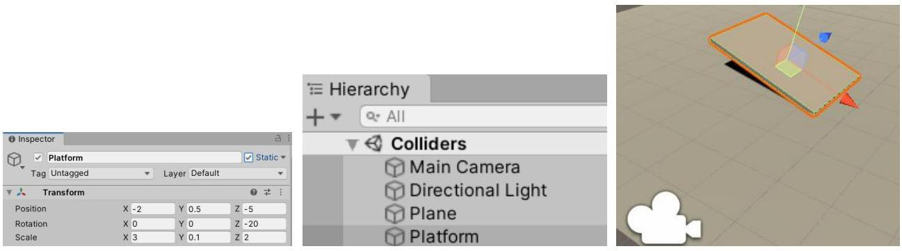
Figure 2. Platform's Transform component values (left), the scene hierarchy (middle), and a preview of the scene (right)

Then add a Sphere and another Cube to the scene. The sphere should be above the platform and the cube should be positioned so that when the sphere rolls down the platform hits it.

Note: You can change the appearance of the objects if you want by creating materials and assigning them to the objects. To create a new material right click in the Project window in the assets and from the context menu choose Create  $\rightarrow$  Material. Then select the material and change its Albedo color or assign an Albedo texture. To assign the material to an object simply drag the material to the object in the Hierarchy or Scene Window.

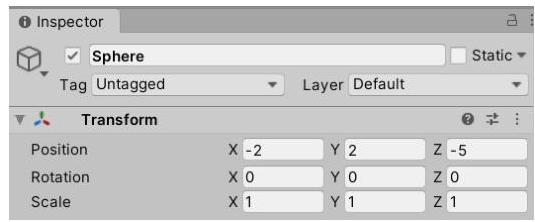
Figure 3. Sample values for the Sphere and the Cube

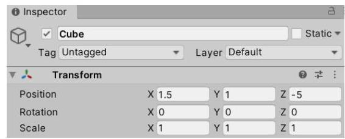

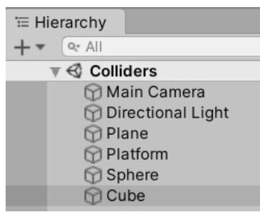
Figure 4. Hierarchy and scene view with the sphere and the cube

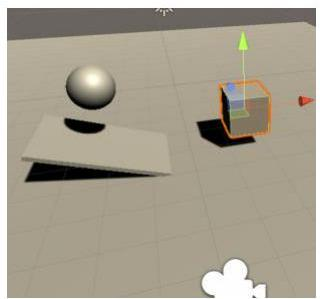

If you enter Play Mode now (Press the Play button or hit Ctrl + P on the keyboard) you will see that nothing changes. This is because the objects are currently not taking part in the physics calculations, there are no forces that affect them. To make an object take part in the physics calculations it needs a component called Rigidbody. A Rigidbody component tells Unity that the object it's attached to have to be included in the physics calculations as well as what are its physics properties. For more information see https://docs.unity3d.com/Manual/class-Rigidbody..

Note: Don't forget to exit Play Mode before making changes to the scene / objects in it because any changes you make while in Play Mode will not be saved!

First add a Rigidbody component to the Sphere and enter Play Mode. You will see the sphere falling, rolling on the platform and stopping when it hits the cube. The sphere falls and rolls under the effect of gravity (because the Use Gravity check box in its Rigidbody component is checked). It then stops at the Cube because both the Sphere and the Cube have Collider components and a collision is detected (the same happens when the Sphere hits the Platform and the Plane).

Note: If any of the objects didn't have a Collider component a collision would not be detected – try removing (right click the component's label  $\rightarrow$  Remove Component) or deactivating (uncheck the check box next to component's label) the Box Collider component of the Cube for example – when you enter Play Mode you will see the Sphere passing through the Cube.

So a collision between the Sphere and the Cube is detected but the Cube is not affected. This is because the cube doesn't have a Rigidbody component. If you add a Rigidbody component to the Cube too, you will see the Sphere pushing the Cube a little when you enter Play Mode. You can try changing the Mass

and Drag properties of the Rigidbody components of the Sphere and the Cube to see how that effects their behaviour. For example make the mass of the Sphere much higher than that of the Cube.

# Using scripts to react to collisions

Unity gives the possibility to detect collisions and react to them using scripts. To create a new script, right click in the Project window in the Assets and from the context menu select Create  $\rightarrow$  C# Script and name it ColorChanger.cs. We will use this script to change the color of the Cube when a collision is detected.

Note: It is important that the name of the .cs file and the name in the class in it are the same. Otherwise Unity will not allow you to assign the script to a game object.

By default the classes (when created in Unity) inherit from the MonoBehaviour class (see https://docs.unity3d.com/ScriptReference/MonoBehaviour.). Its members give access to the game object's fields and components using MonoBehaviour's properties and methods. By default the class contains two empty methods – void Start() and void Update(). As the comments above them say the Start() method is called once each time the game object to which the script is attached is activated and the Update() method is called once each frame to update the state of the game object.

To react to collisions, we will add another method to the ColorChanger class:

```cs
private void OnCollisionEnter(Collision collision)
{
    GetComponent<renderer>().material.color = Color.red;
}
```

Note: Don't forget to save the file before going back to Unity.

First we get a reference to the Renderer component of the game object (the Renderer is the component that takes care of rendering an object). The Renderer contains a reference to the material used to render the object, and the material has a color property containing the color with which to render the object. With this single line of code we tell the Renderer to render the object with red color.

Back in Unity if you enter Play Mode you will notice that the cube Turns red before the Sphere hits it. To understand why we will output the name of the object which collides with the Cube in the Console window. Add this line to the OnCollisionEnter method:

Debug.Log(collision.gameObject.name);

From the collision parameter supplied by the OnCollisionEnter method we can gain additional information about the collision - see the documentation of Unity's Collision class (https://docs.unity3d.com/ScriptReference/Collision.). In this case we use the Log method of the Debug class to print the name of the game object that collided with the Cube to the Console window.

Entering Play Mode and switching to the Console window (Ctrl + Shift + C) you will see two lines – Plane and Sphere. This means that the Cube first collided with the Cube and then with the Sphere.</renderer>

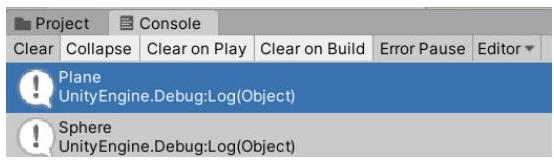
Figure 5. The output in the Console window

If we want to react only to a collision with the Sphere, there are multiple ways to do that. One is to assign the sphere a tag and check if the colliding object's tag is the one we are interested in. Select the Sphere and at the top of the Inspector window click on the Tag combo box and select Add Tag. In the Tags list that opens click the + button, enter ColorChanger for the new tag and press Save.

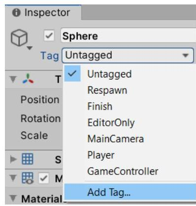
Figure 6. Adding a new Tag

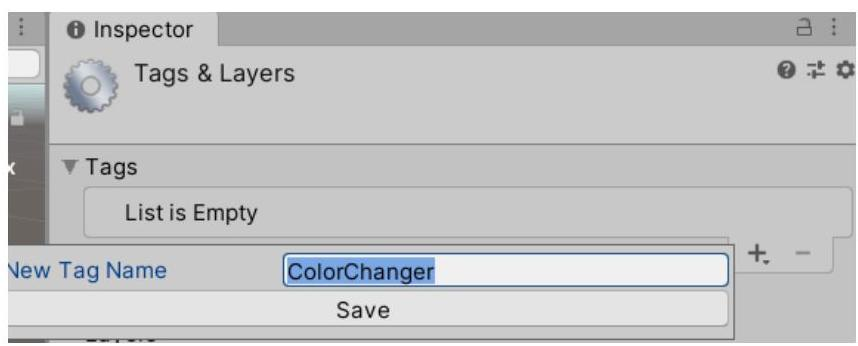

Select the Sphere again and set its Tag to ColorChanger.

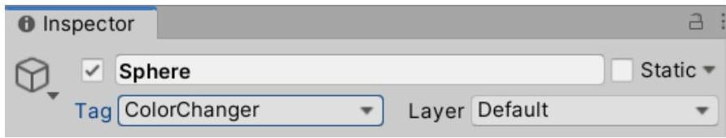
Figure 7. The Sphere with its Tag set to ColorChanger

Go back to the ColorChanger script and edit the OnCollisionEnter method to change the color of the object only if the tag of the colliding object is "ColorChanger". Make sure to write the name of the tag correctly.

```cs
private void OnCollisionEnter(Collision collision)
{
    if (collision.gameObject.tag == "ColorChanger")
    {
        GetComponent<renderer>().material.color = Color.red;
    }
}
```

Save the changes, switch to Unity and enter Play Mode. You will see that now the Cube's color changes only after the Sphere hits it.

# Adding class fields that can be edited in the Unity Editor.

Instead of hard coding the color to which to change we can add a little flexibility by allowing the color to be changed in Unity. Thus for example using the same script on multiple objects but each object changing</renderer>

to a different color. Unity automatically shows public fields or private fields with the serializeField attribute in the Inspector window. Add a public Color field to the ColorChanger class and use it to set the color to which the Cube's color changes. The whole ColorChanger class looks like this:

```cs
public class ColorChanger : MonoBehaviour
{
    public Color newColor;
    private void OnCollisionEnter(Collision collision)
    {
        if (collision.gameObject.tag == "ColorChanger")
        {
            GetComponent<renderer>().material.color = newColor;
        }
    }
}
```

If you switch to Unity and select the Cube you will notice a New Color field in the ColorChanger component. Change the color and test it in Play Mode.

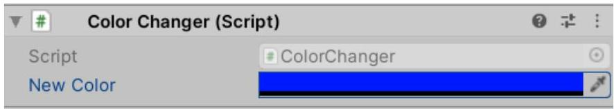
Figure 8. The attached ColorChanger script with the New Color field in the Inspector window for the Cube

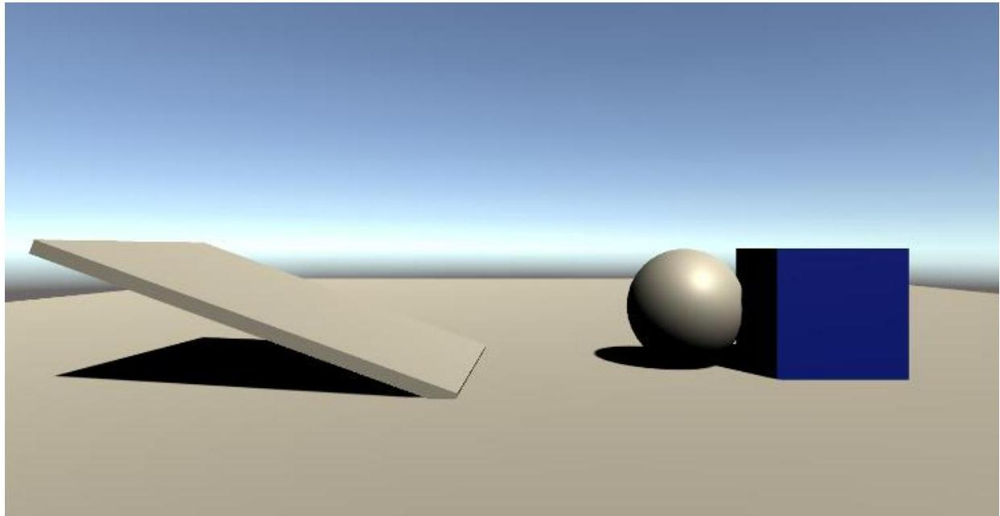
Figure 9. A screenshot from Play Mode</renderer>


