# Final Result

https://github.com/user-attachments/assets/94a17851-4b32-4fea-9bce-169cbc3ed42b

# Preparing a Terrain

Start with a new scene – choose File  $\rightarrow$  New Scene. By default, the scene contains a Camera and a Directional Light game objects. Choose File  $\rightarrow$  Save or press Ctrl+S to save the scene. Name it Terrain.unity.

To add a terrain to the scene right click in the Hierarchy window and from the context menu select 3D Object  $\rightarrow$  Terrain. This will add a terrain to the scene, and you should be able to see it in the Scene Window – it should appear as a plane with a checkerboard texture (if not, you can try double clicking on the Terrain game object in the Hierarchy).

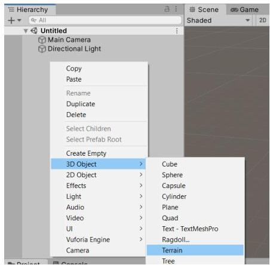
Figure 1. Adding a terrain to the scene

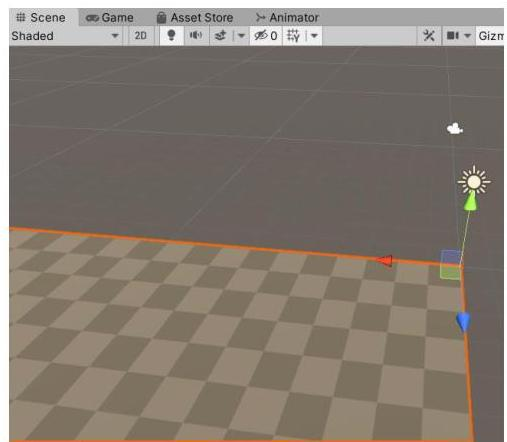

With the Terrain selected the Inspector window will show its components. The Terrain component contains tools for terrain editing. An extensive description of the terrain tools can be found in Unity's documentation - https://docs.unity3d.com/Manual/terrain-Tools.. Click on the Settings button and in the Mesh Resolution (On Terrain Data) group change the Terrain Width and Terrain Length values to 100 to make the terrain smaller. You can adjust other settings also if you want.

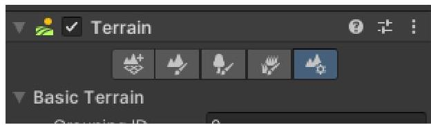

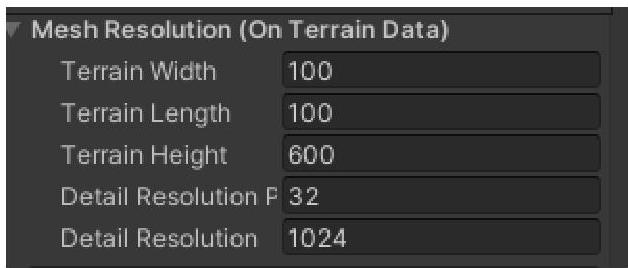
Figure 2. Choose Terrain Settings in the Terrain component and change the width and length of the terrain

# Change the surface of the terrain

Switch to the Paint Terrain tool and from the tools combo box select Raise or Lower Terrain. Choose a brush and shape your terrain. Unity will give you a preview of the chosen brush when you hover with your

mouse over the terrain. You can use the Shift button on the keyboard to lower the terrain and the Smooth Height option from the combo box to smooth sharp edges.

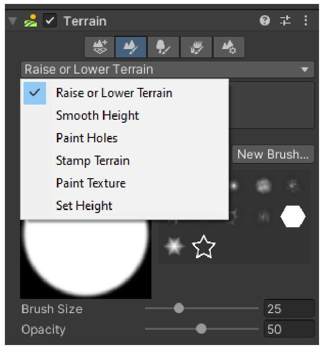
Figure 3. Terrain Tools - Paint Terrain (left), brush preview and added relief (middle), smoothed terrain (right)

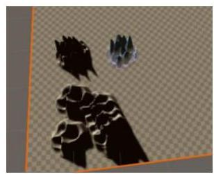

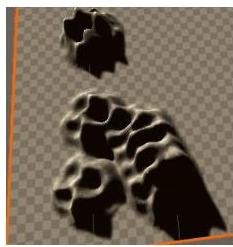

# Adding textures to the terrain

You first need to import textures in your project. You can download some terrain texture assets from the unity asset store, for example this asset.

To add textures to the terrain switch to Paint Texture from the combo box, then press the Edit Terrain Layers and from the menu choose Create Layer. A dialog opens that allows you to pick a texture for the new layer. Type in the search field diffuse to filter only the diffuse textures and double click a texture you like to select it.

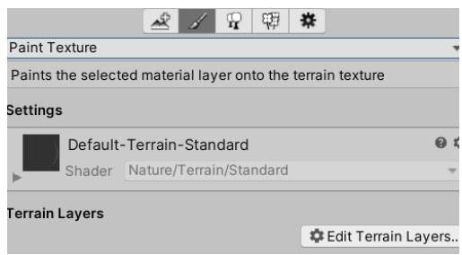
Figure 4. Paint Texture tool and Edit Terrain Layers (left), Create Layer option (middle), choosing a texture for the layer (right)

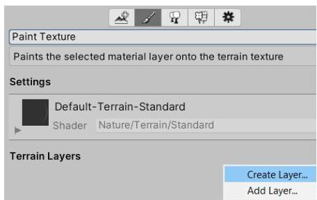

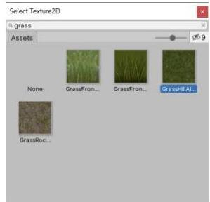

With this the new layer will be created and added to the list of layers. As this is the first layer that is added to the terrain, the whole terrain will be painted with the selected texture. You can find the new terrain in the root Assets folder in the Project window

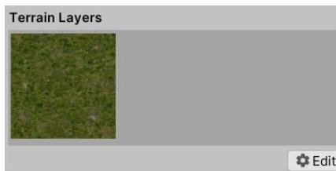
Figure 5. The new layer in the Terrain Layers list (left) and the painted terrain (right)

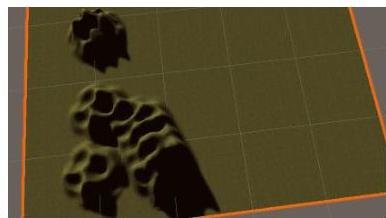

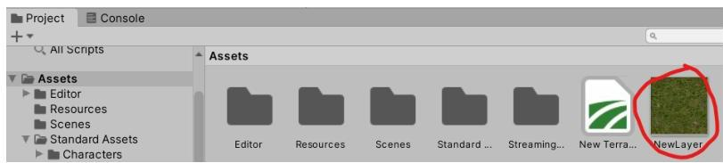
Figure 6. The newly created layer in the Project Assets

To add more detail to the terrain, click again on the Edit Terrain Layers  $\rightarrow$  Create Layer and choose another texture. Make sure the new layer is selected in the Terrain Layers list and using a chosen brush by clicking with your mouse paint with the new texture on the terrain (keep in mind you can also adjust the brush size and opacity).

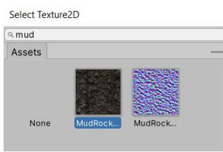
Figure 7. Adding a Mud layer and painting with it on the terrain

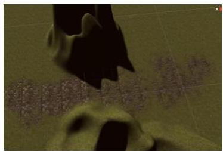

This adds more detail to the terrain, and it starts to look better, but the texture looks flat. This can be improved by adding a Normal Map to the layer. Under the Terrain Layers list you will see three textures – Diffuse Map, Normal Map and Mask Map. Click on the Select button of the Normal Map and in the Select Texture2D window search using the name of the diffuse texture you used and select the respective normal map (the normal map is the one tinted blue). You will notice immediately how the areas painted with the selected layer start to have more detail and look rougher.

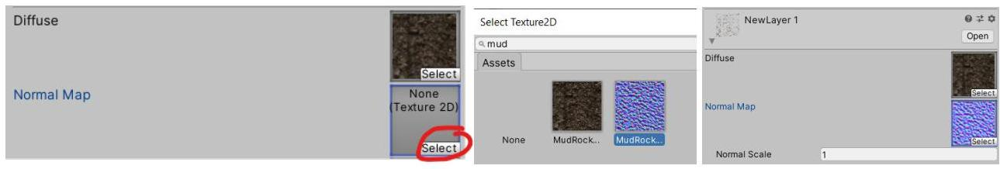

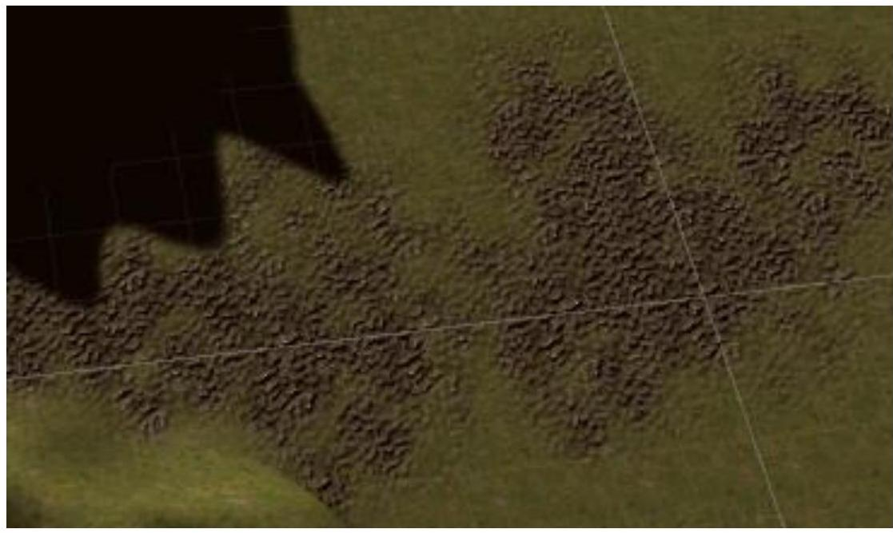
Figure 8. Adding a Normal Map to the terrain layer to make it more realistic

# Adding Trees

To add trees you first need the tree models – you can download an asset from the Unity Asset Store, for example this asset.

Switch to the Paint Trees tool. Press the Edit Trees button and then choose Add Tree. In the Add Tree dialog press the button next to the Tree Prefab field, select one of the trees that appear in the list and press Add.

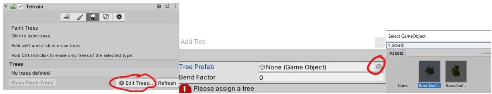
Figure 9. Adding a Tree to the Trees list

You can then use the brush and tree settings to add trees to the terrain.

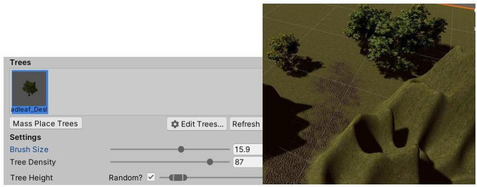
Figure 10. Adding trees to the terrain

# Walking on the terrain

To be able to walk on the terrain we will use a FirstPersonController from Unity's First Person Starter Assets package. When importing the package, it will automatically suggest installing dependency packages, for example the Input System package, etc. The Unity Editor will ask for a restart after the package installation has completed.

Note: If the Unity Editor restarts before you import the package, you'll have to import it after the editor restarts. If the import is successful you should see a StarterAssest folder in the project window.

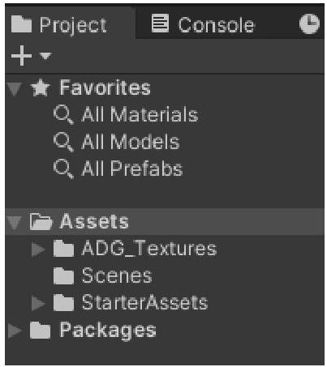

Because you will be adding a new camera, first the existing MainCamera in the scene needs to be deleted. Then, in the Project window go to Standard Assets  $\rightarrow$  StarterAssets  $\rightarrow$  FirstPersonController  $\rightarrow$  Prefabs and drag a PlayerCapsule prefab on the terrain in the Scene window where you want the First Person Character to appear. You can use the Move tool to further adjust the PlayerCapsule position. Then drag also a PlayerFollowCamera and a MainCamera prefab in the Hierarchy. Expand the PlayerCapsule game object in the hierarchy to show it's children, then select the PlayerFollowCamera game object and in the Inspector window in the Follow field of the CinemachineVirtualCamera component drag the PlayerCameraRoot object:

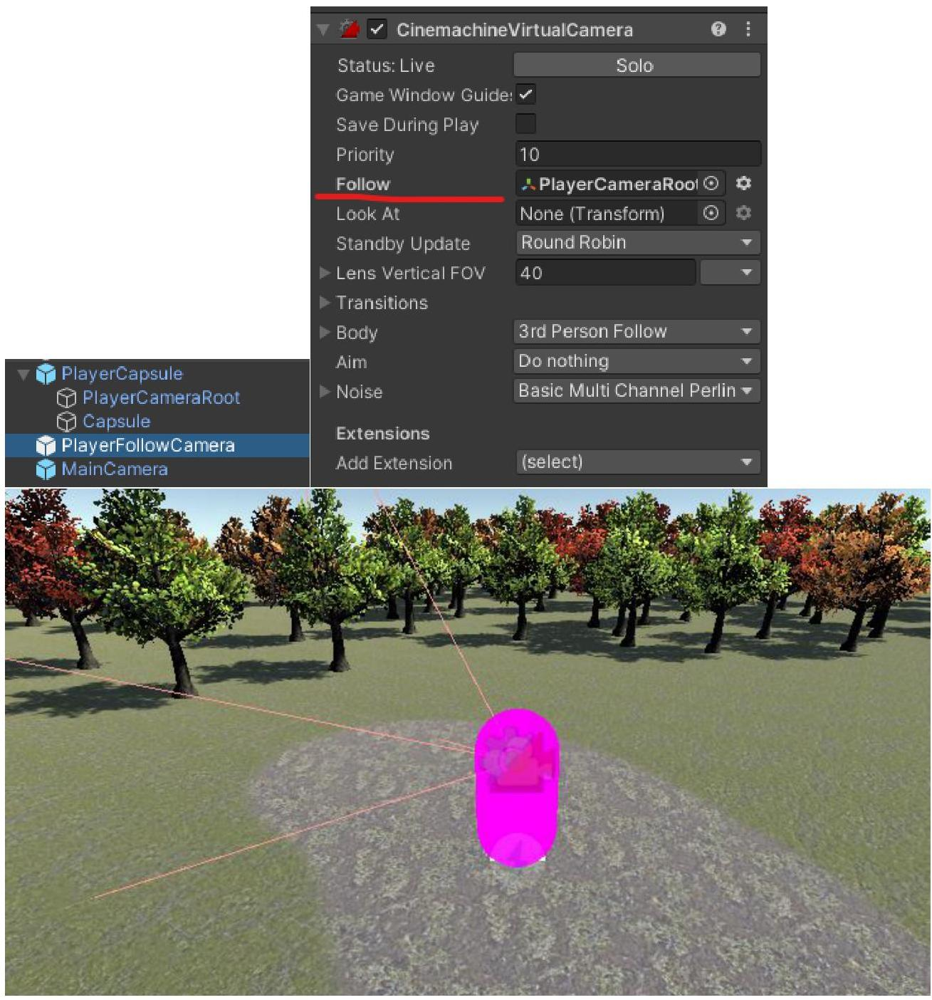
Figure 11. Adding a First Person Controller to the scene

You can change the properties of the FPS Controller – with the PlayerCapsule selected in the Hierarchy change the Move Speed and Sprint Speed properties of the First Person Controller component in the Inspector window.

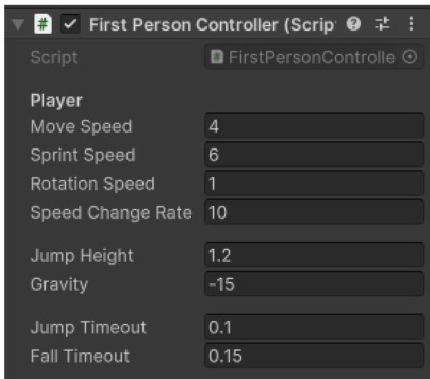
Figure 12. Edit the First Person Controller properties

Now you can press the Play button to enter Play Mode and test the scene. If everything is in order Unity will switch automatically to the Game window and you should be able to walk and look around using your mouse and the arrow or WASD keys on the keyboard.

# Adding custom 3D models

To add 3D models to the scene you have two options:

Download and import an asset from Unity's Asset Store (including a lot of free assets)
- Create your own or download a third-party 3D model and added to the assets

Downloading from the Asset Store is straightforward – just like you added the other packages.

To import your own or downloaded 3D model you have multiple options:

- Drag files, or a folder containing all related files, from the File Explorer to the Assets in the Project window in Unity.
- Copy the files to the project's Assets folder in the file system - Unity synchronizes the Assets folder in the file system where you chose to store your project with the Assets folder in its Project window. To open the Assets folder in File Explorer you can right click in the Project window and select Show in Explorer from the context menu.
From the Assets menu choose Import New Assets.

No matter which option you use, don't forget to import all related files for the model, for example all textures, not only the file containing the 3D model.

Note: Unity supports .fbx and .obj file formats for 3D models.

To add a 3D model from the assets into a scene just drag the 3D model to the Scene or Hierarchy window and adjust its position and orientation.

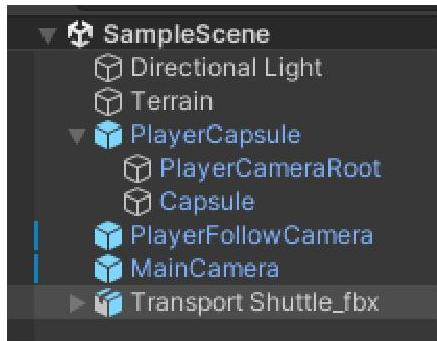
Figure 13. Hierarchy and Scene view with added 3D model of a shuttle

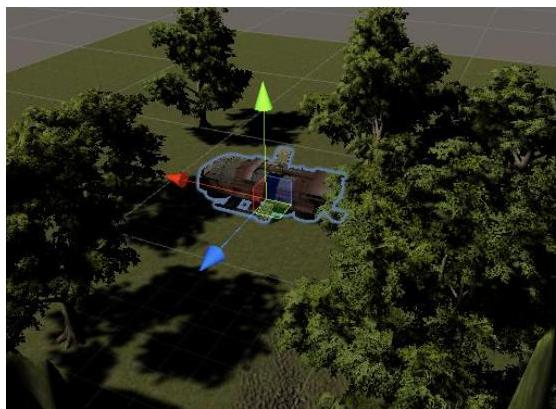

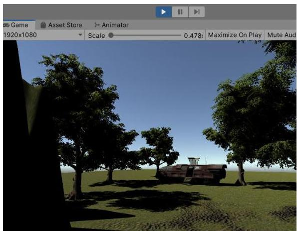
Figure 14. Different views in Play Mode

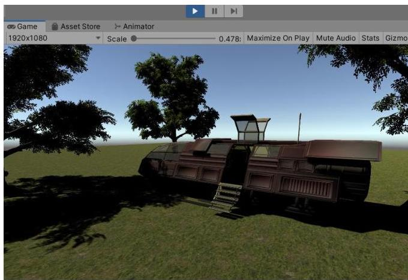

