Create a new project in Unity Hub using the 3D template, enter a project name, and select a location to store the project.

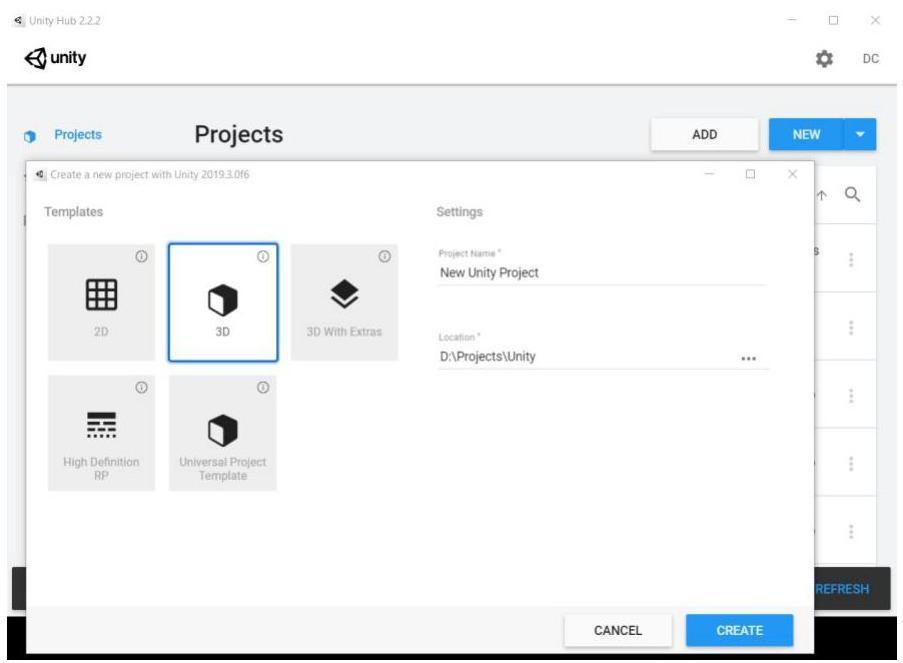

Open the Build Settings from the File  $\rightarrow$  Build Settings menu. From the platforms choose Android and press the Switch Platform button.

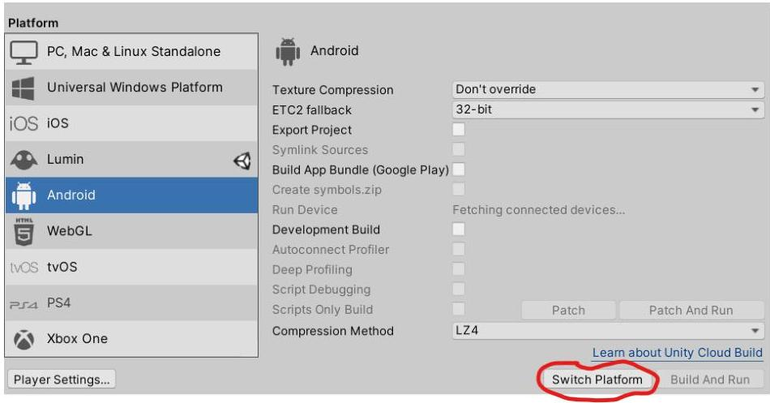

*Note: It is better to choose / switch the platform at the beginning, as otherwise, if you do it at a later point of the development, all the assets you have imported will have to be reimported for the new platform.

Open the Package Manager (from the Window menu  $\rightarrow$  Package Manager) and install the Vuforia Engine AR package.

*Note: for newer versions of Vuforia (starting 10.5) you should follow the instructions on https://library.vuforia.com/getting-started/vuforia-engine-package-unity.

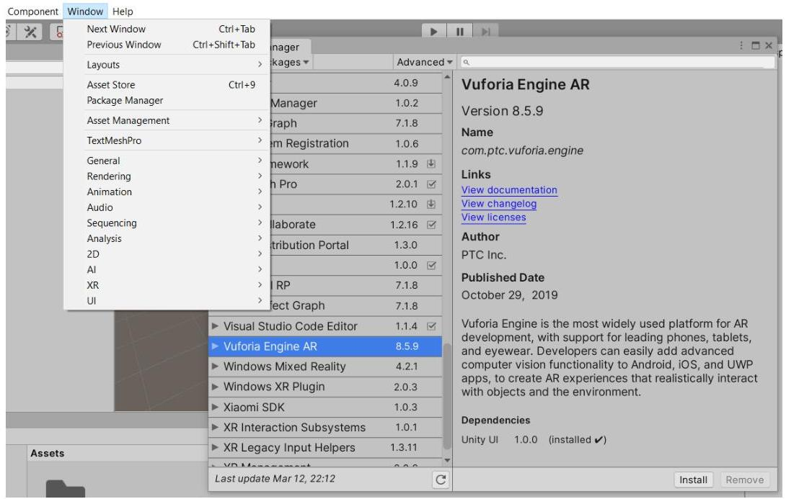

In the Hierarchy window delete the Main Camera game object and from the context menu (mouse right-click) choose Vuforia Engine  $\rightarrow$  AR Camera to add an AR camera to the scene.

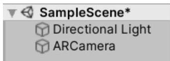

In the https://developer.vuforia.com page in the License Manager tab create a new Development key and enter a name for the key/project. Once it appears in the list, open it and copy the license key.

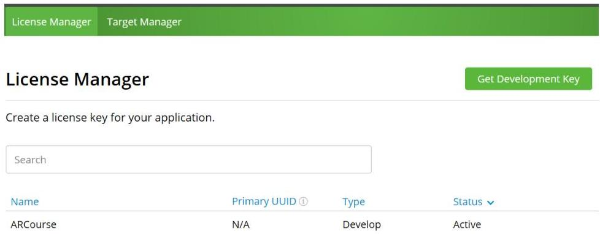

In Unity select the AR Camera game object in the Hierarchy. In the Inspector press the Open Vuforia Configuration button and paste the license key in the field App License Key (without pressing the Add License button).

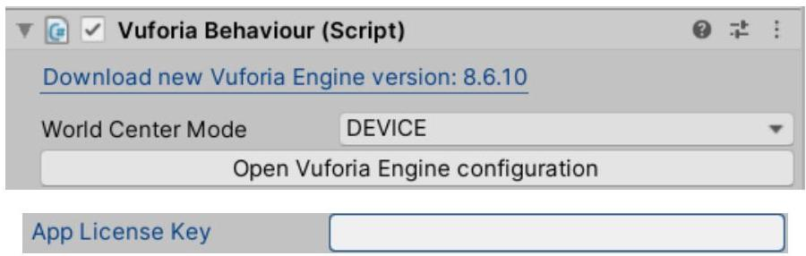

In Vuforia's web page open the Target Manager tab and press the Add Database button. Enter the name of the database and choose Device for its type (data about the markers will be stored on the device).

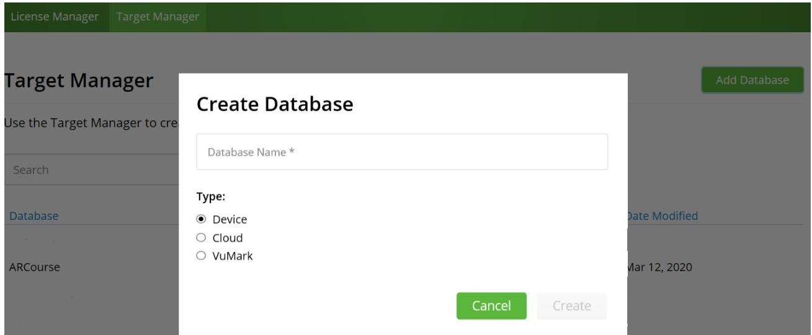

Open the new database and press the Add Target button. Leave the type to the default Single Image, select an image (must be a jpg or png file, but 24 bit, with no transparency (no alpha channel)) and enter the expected width of the marker in the physical environment in meters (as this is the unit of measurement used in Unity where the marker will be used). For example, if the marker will be 20 cm after printing, enter 0.2 for the width. Check the rating of the marker and take a look at its feature points – click on the marker to open it and press Show Features button. (After adding the marker, the rating may not be updated immediately. In this case, click on the Refresh link below the marker list.)

After adding the marker(s), press the Download Database button. If you want to download only some of the markers, check their checkboxes in front of the marker's name. In the download screen, select Unity Editor. This will download a .unitypackage file that you can open directly and it will open in Unity or you can drag it in the assets in the Project window in Unity.

After importing the database package in Unity right click in the Hierarchy window and from the context menu choose Vuforia Engine  $\rightarrow$  Image. This adds an ImageTarget game object. With the ImageTarget game object selected, in the Inspector, in the Image Target Behaviour component, switch the Type drop down to "From Database", from the Database drop down choose the name of your database and from the Image Target drop down choose the name of the target you want to be recognized by this Image Target game object. If you expand the Advanced group, you'll notice that the value you entered for Width when you created the Image Target in the Vuforia Developer Portal has been transferred to the Physical Width field, while the Physical Height field has been calculated from the image aspect ration.

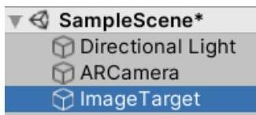

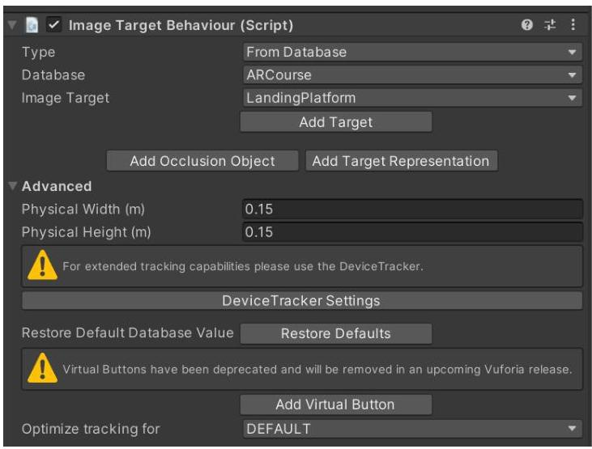

Add a 3D model and its dependencies (i.e. textures) to the project's assets – you can drag the files (or a whole folder) from File Explorer to the assets in Unity's Project window, or copy the files in the Assets folder of the project in File Explorer (the Assets fold can be found at Path_to_project\Assets, for example D:\Unity\ARShuttle\Assets), or from the menu Assets  $\rightarrow$  Import New Asset.

Add a 3D model to the hierarchy in Unity as a child of the ImageTarget game object. This way, when the marker is recognized the 3D model will show, and when the marker is lost the 3D model will hide. It is probable that the scale of the model will not match the marker's scale and must be adjusted. For large scale changes, it is a good idea to set the scale when importing – select the model's asset in the Project window, in the Inspector adjust the Scale Factor and press the Apply button. For smaller scale changes, you can directly edit the Scale in the Transform component of the game object. The 3D model must be aligned by size, position and orientation in the scene in relation to the marker present in the scene.

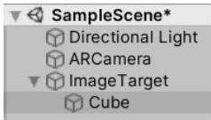

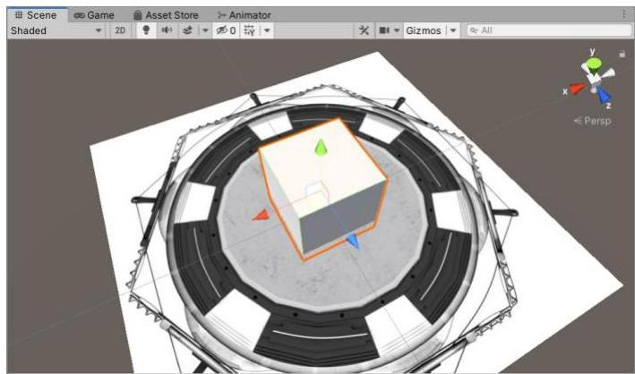

Run the application from the Play button. By pointing the camera at the marker, the object appears on the marker.

