Open the ARShuttle project from last time.

# Animating the Shuttle

The shuttle model is rigged, which means it has a skeleton system (bones) that can be used to transform and animate the model. For example, you can use the Rotate tool ( ) to rotate Bone_Door_Down* and Bone_Door_UP* bones to close the doors of the shuttle. (Make sure the transform mode is set to Local.) Click and drag on the axis red circle to rotate the bone (and respectively the door) around the X axis. Keep rotating until the door is closed. For the Bone_Door_UP_L that's until you reach about 130 degrees on the Y axis. (You drag around the X axis but affect the Y axis because there is already a 90-degree rotation around the Z axis.) By closing the doors, the initial state of the shuttle with closed doors is set.

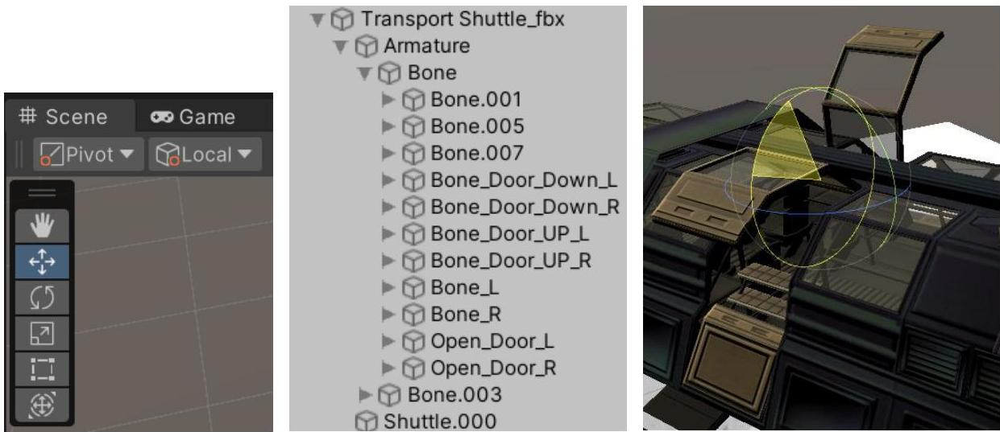

Open the Animation (menu Window  $\rightarrow$  Animation). The Animation Window can be used to create key frame animations directly in the Editor. Select the shuttle in the Hierarchy. As the shuttle currently contains no animations the Animation window will be empty containing only a Create button to create a new animation. Press the Create button - Unity will ask you for a name of the animation and where to store it. Name the animation OpenDoor.anim. On the left side of the animation window you will see the Add Property button. Extend Armature  $\rightarrow$  Bone  $\rightarrow$  Bone_Door_Down_R  $\rightarrow$  Transform and press the plus sign next to Rotation. This will add a row for the Rotation property on the timeline with keys at the beginning and at the end. To animate the door, go to the end frame (click on the time (at the top) for the last frame of the timeline - the white line of the current frame appears at the end frame) and press the Record button. Then select the Bone_Door_Down_R in the Hierarchy and rotate the bone so that the door is opened. When ready press the Record button again to turn off record mode. If everything is fine when you play the animation you should see the lower part of the right shuttle door opening.

Note: The keys in the timeline store the data about the object's state at that time. The engine interpolates the values between the keys to animate the object. You can adjust the animation by adding and/or moving the keys in the timeline.

In the Animation window add also the Bone_Door_UP_R  $\rightarrow$  Transform  $\rightarrow$  Rotation property and repeat the steps to animate how it opens. If you play the animation now you will see that the lower and upper parts

of the door open but the lower part passes through the upper one. The animation of the lower part of the door needs to be adjusted to start a little bit later than the upper one. In this case it is enough to select the start key of the animation for the Bone_Door_Down_R: Rotation property and move it to a later frame which will make it start later.

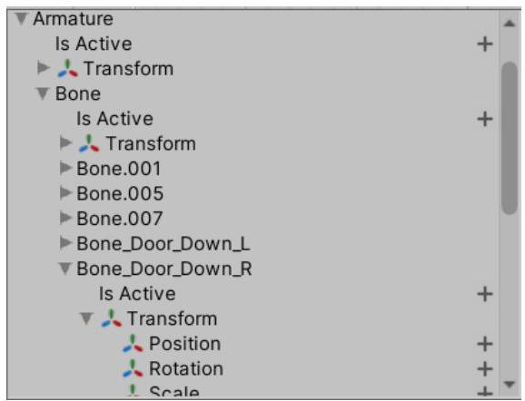

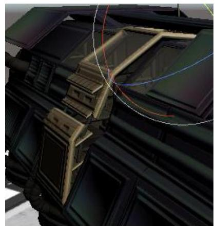

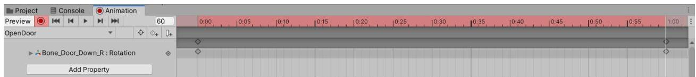

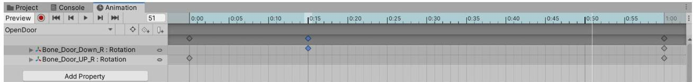

If you enter play mode now you will see the doors opening and closing constantly. The avoid this you have to select the animation file (OpenDoor.anim) in the Assets and turn of the Loop check box in the Inspector.

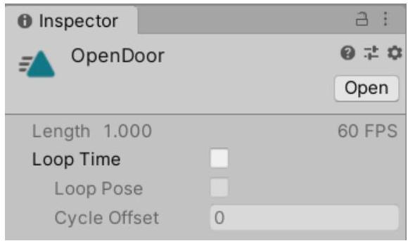

Now when you enter play mode the doors will open once and then remain open. But they still open automatically when the model is activated. To change this behaviour we have to adjust the animation state machine for the shuttle in the Animator window.

If you select the shuttle in the Hierarchy you will see in the Inspector that it now has an Animator component. Double click the controller field to open the Animator window with the state machine for the shuttle. Currently the state machine has a single OpenDoor state that is marked as the entry state, which means by default the object starts in this state and the animation of that state is played.

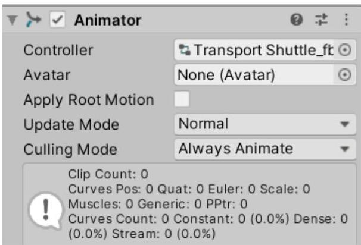

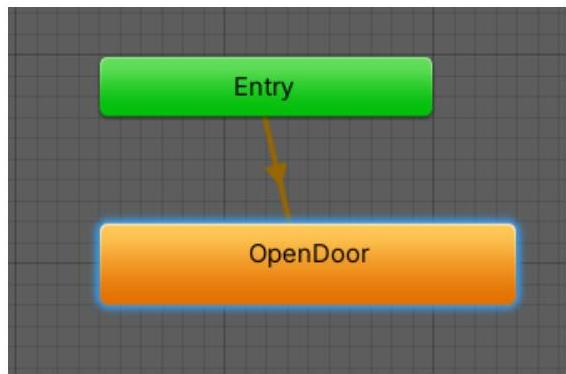

To change this, you have to add a new empty state, typically called an idle state with no animation or containing the "Idle" animation of the model. Right click in an empty space in the Animator window and select Create State $\rightarrow$ Empty from the context menu. Select the state and change its name in the Inspector to Idle. Then right click on it and select Set as Layer Default State. Now the default state of the model will be the Idle state and when the application is started the OpenDoor animation will not be played automatically. However currently there is no way that it can be played because it is not connected to any state with a transition – right click on the Idle state, select Make Transition and click on the OpenDoor state to make a transition from the Idle state to the OpenDoor state. What remains is to specify a condition for the transition – when will the animator change from the Idle to the OpenDoor State. In the left part of the Animator window make sure that the Parameters tab is selected, click on the plus sign and select Trigger, to add a trigger parameter. Name the trigger "open". Select the transition between the Idle and OpenDoor states and in the Inspector click the plus sign of the Conditions list. Because the "open" trigger is the only parameter available it will be automatically selected as the condition for the transition.

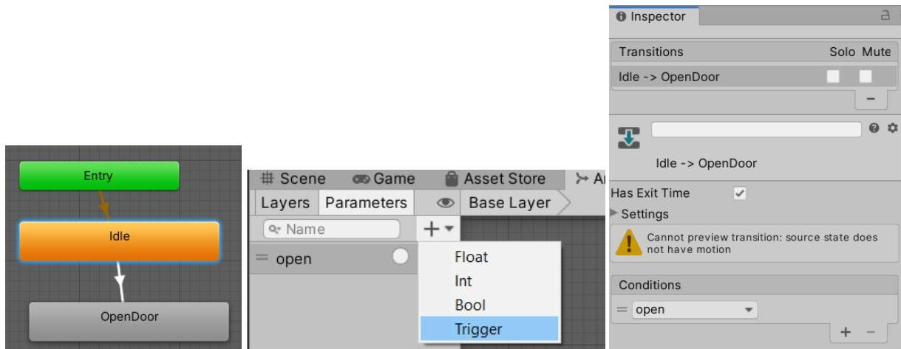

The Animator will change from the Idle to the OpenDoor state when the "open" trigger is set. (Triggers reset automatically.)

Animator parameters can be set from script. We will look into two options for user interactions which we can use as a signal to open the doors of the shuttle (to trigger the transition) – using a second AR marker and using mouse click / screen touch.

# Using a Second Marker to Trigger Animation

We are going to use a second marker to signal for the doors to open - when the application sees the marker it will set the animator trigger and play the animation.

Open the Vuforia Developer web site (developer.vuforia.com), login, open the database you are using for the course and add a new target - upload the Open.jpg image. Download the database for Unity and import the unity package in the project. For more detailed instructions refer to the ARShuttle_Part1 document.

In Unity from the Window menu select Vuforia Configuration and in the Inspector change the Max Simultaneous Tracked Images to 2. Then right click in the Hierarchy and select Vuforia Engine $\rightarrow$ Image Target to add a second Image Target game object. Select it and in the Inspector make sure that the Image Target field is set to the Open target. To differentiate between the two Image Target game objects, rename this one to ImageTarget_Open.

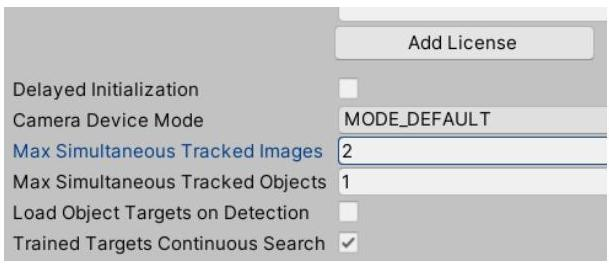

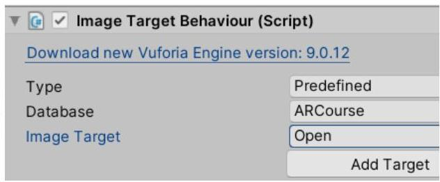

Vuforia Image Targets use the DefaultObserverEventHandler.cs script to handle when a target is Found, and Lost. To add custom behaviour to when an Image Target is Found or Lost we can add event handlers to the OnFound and OnLost events.

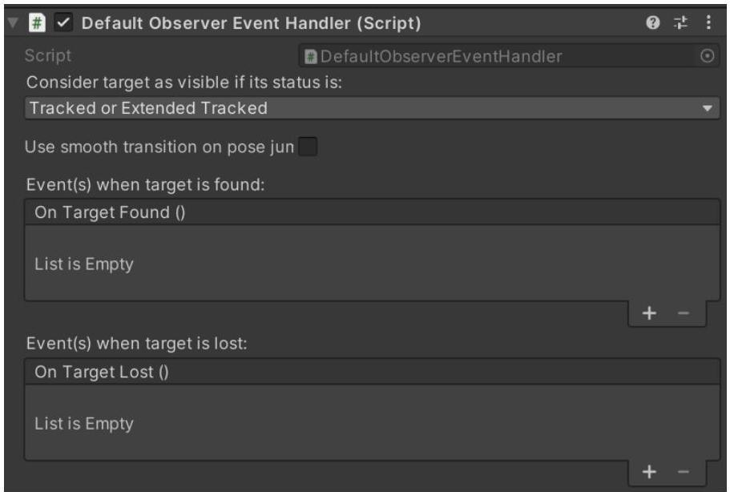

First create a Shuttle class - right click in the Project window and select Create  $\rightarrow$  C# Script. Name it Shuttle. Add a private field of type Animator, add an Awake method and get a reference to the Animator component in the Awake method. Then add a public void OpenDoors method which will be used to trigger the state transition in the animator and respectively the animation. The complete code looks like this:

```cs
using UnityEngine;
public class Shuttle : MonoBehaviour
{
    private Animator animator;

    void Awake()
    {
        animator = GetComponent<Animator>();
    }

    public void OpenDoors()
    {
        animator.SetTrigger("open");
    }
}
```

Drag the script on the Transport Shuttle object to add it as its component.

This overload of the Animator.SetTrigger function accepts the name of the trigger as parameter. Make sure that it is written exactly as the name of the trigger parameter in the Animator window. You can find the reference of Unity's Animator class at https://docs.unity3d.com/ScriptReference/Animator.html.

Select the ImageTarget_Open game object. In the DefaultObserverEventHandler component you will see the OnTargetFound list – this is the list with event handlers to be invoked for the OnTargetFound event. Click on the plus sign to add a new handler. In the Object field drag the Transport Shuttle game object from the Hierarchy and from the Function combo box select the Shuttle → OpenDoors method.

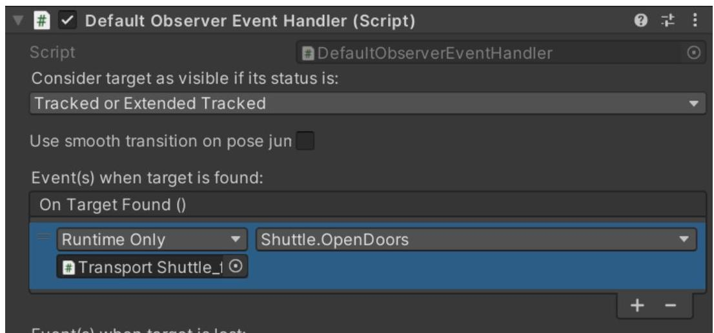

What we did is – when the Vuforia Engine recognizes an image it will call the OnTargetFound method. Because in the Editor we added the Shuttle.OpenDoors method to the event handler list it will be invoked when the target is found (in this case the Open.jpg target) and the animation opening the door will be played.

If you enter Play Mode – when you show the LandingPlatform.jpg image the shuttle will be rendered on top of it. When you show also the Open.jpg image (while still showing the LandingPlatform.jpg image, at the same time) the animation for opening the doors will be played.

Currently once the animator has switched to the OpenDoors state it remains there, because it has no exit transition. Which means the application will play the OpenDoors animation only once and afterwards the doors will remain open.

Your further task is to create a CloseDoors animation, add its state to the animator, add a close trigger and add a transition from the OpenDoors state to the CloseDoors state with the close trigger as a condition. Then add a transition from the CloseDoors state to the Idle state. In this way when the CloseDoors animation ends the animator will return to the Idle state and will be able to respond to a new open trigger.

Add a Close target to the Vuforia database (you can use the Close.jpg), add another ImageTarget for it in Unity and make it trigger the CloseDoors animation. (For the purpose you will also need to add a CloseDoors method to the Shuttle class to trigger the close trigger and add it as an event handler to the OnTargetLost event of the DefaultObserverEventHandler of the new ImageTarget.)

# Handling Input

We will be using Unity's new Input System. First it must be enabled in Player Settings – from the main menu select Edit → Project Settings → Player. In the Other Settings group find the Active Input Handling option and from the combo box switch to Input System Package (New).

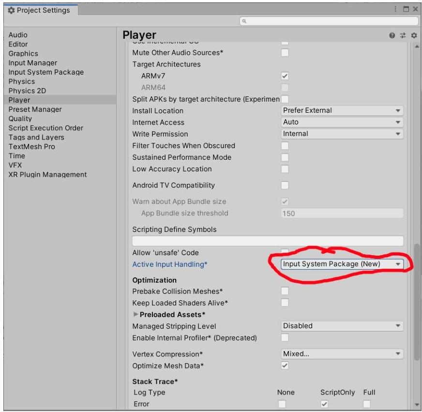

Unity will ask you to restart the Editor.

Open the Package Manager (from the Window menu  $\rightarrow$  Package Manager). Search for and install the Input System package. (Make sure that the Packages filter is set to Packages: Unity Registry.)

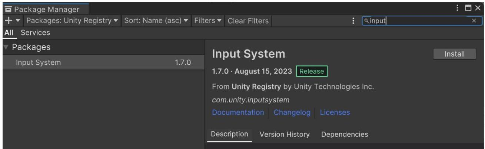

Note: Extensive information on what the new Input System is and how it can be used can be found in its documentation - the Documentation link in the Package Manager, currently - https://docs.unity3d.com/Packages/com.unity.inputsystem@1.7/manual/index.. The idea behind the new Input System is to add an intermediate layer abstracting actions from devices by allowing us to define an action and then bind one or multiple input devices to that action.

To allow user input we will define our own class with InputAction fields for the user interaction we want to have. Create a new C# script and call it DetectPress.cs and add it as a component to the Transport Shuttle game object. Place the following code in the script:

```cs
using UnityEngine;
using UnityEngine.InputSystem;
public class DetectPress : MonoBehaviour
{
    private Shuttle shuttle;
    public InputAction press;
    public InputAction position;
    private Vector2 currentPos;

    // Start is called before the first frame update
    void Awake()
    {
        shuttle = GetComponent<shuttle>();

        press Enable();
        press performed += Press_performed;

        position Enable();
        position performed += x =&gt; currentPos = position.ReadValue<vector2>();
    }
    private void Press_performed(InputAction.CallbackContext obj)
    {
        Ray r = Camera.main.ScreenPointToRay(currentPos);
        RaycastHit hitInfo;

        if (Physics.Raycast(r, out hitInfo) &amp;&amp; hitInfo.collider.tag == "Shuttle")
        {
            shuttle.OpenDoors();
        }
    }
}
```

Note: If the compiler doesn't recognize the InputSystem namespace you may have to restart Unity and your development environment (i.e. Visual Studio).

We define two InputActions:

public InputAction press – to detect when the user clicks or touches the screen

public InputAction position – to track the position of the pointer.

Note: The Pointer device in the Input System's terms is the primary device used for pointing and interaction, like the mouse on a computer or tapping on a touch screen.

In the Awake method we get a reference to the Shuttle component and then enable the two Input Actions and assign event handlers to their performed event – whenever the user performs the action, they are listening for the registered handlers will be called.

The line positionPerformed ```+= x => currentPos = position.ReadValue<Vector2>();``` uses an anonymous method (designated in C# with => - to the left are the parameters and to the right is the body of the anonymous method). In our case this anonymous method will be called whenever the Pointer device (for example, mouse) is moved and will assign the position of the pointer to the currentPos variable.

The Press_performed method will be called whenever a press Input Action is performed. It uses the position stored in the currentPos variable to make a Raycast in the scene and check if something lies under the coordinates where the user pressed. This is done using the Unity defined Raycast method of the Physics class. If the raycast hits something, the data about the hit will be stored in the hitInfo parameter. In this case we check if the hit object has a tag equal to "Shuttle", in which case we call the OpenDoors method of the Shuttle component.

For this to work the Transport Shuttle game object must have a collider assigned, otherwise the raycast will not detect a hit. Also, we need to define a new Tag, called Shuttle and assign this tag to the Transport Shuttle game object.

In Unity select the Transport Shuttle game object and add a Box Collider or a Capsule Collider and adjust it using the Edit Collider button. Then click on the Tag combo box in the Inspector and select Add Tag, enter Shuttle for the new tag. Select the Transport Shuttle game object again and from the Tag combo box select the Shuttle tag.

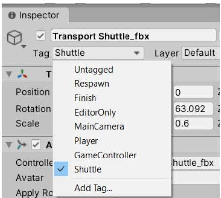

In the DetectPress component you will see two lines – Press and Position – these are the two Input Actions we defined in the DetectPress class. We have to define bindings for these two actions – what devices and how will the user use to perform these actions. Click on the plus sign next to Press and select Add Binding. This will add a new binding, currently saying “No binding”. Double click it to open the Bindings dialog. Click on the Path combo box and select Pointer  $\rightarrow$  Press.

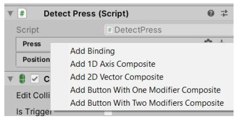

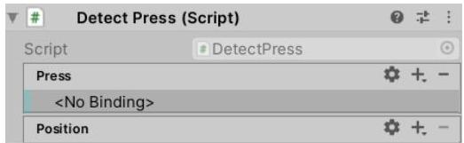

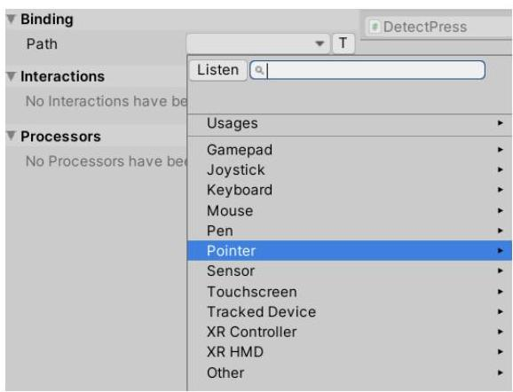

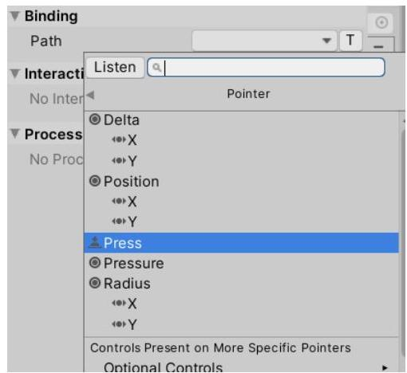

Click the plus sign next to the Position action, double click the new row and this time in the Path combo box select Pointer  $\rightarrow$  Position.

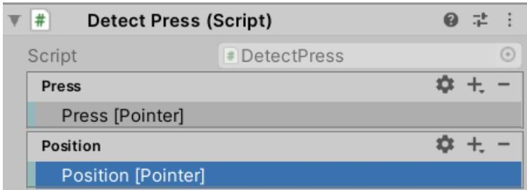

If everything is correct when you enter Play Mode and show the LandingPlatform marker, the shuttle will appear and if you click on it the doors will open. If you click somewhere outside the shuttle nothing should happen because we check if the click is over the shuttle. If you remove the raycast check and call directly shuttle. OpenDoors in the Press_performed handler the animation will play no matter where you click.

If you build the project and install it on your phone this should also work if you tap on the shuttle. This is the benefit of using the new Input System. In this case the Pointer device is an abstract device that represents the mouse on a computer or the tapping on a touch screen. But we could add also other bindings to the Input Actions allowing for other kinds of interactions.