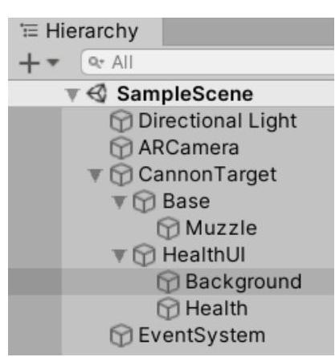
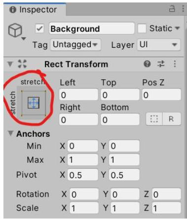
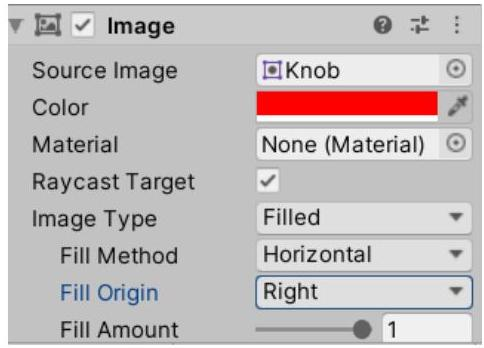
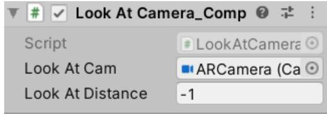
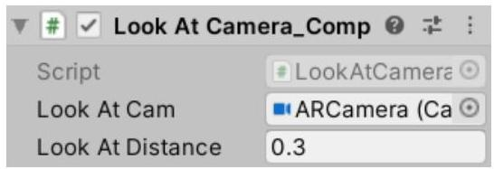
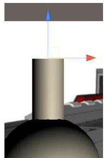
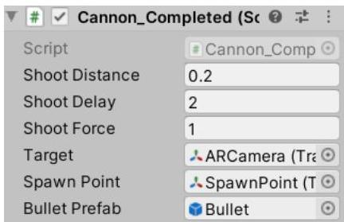
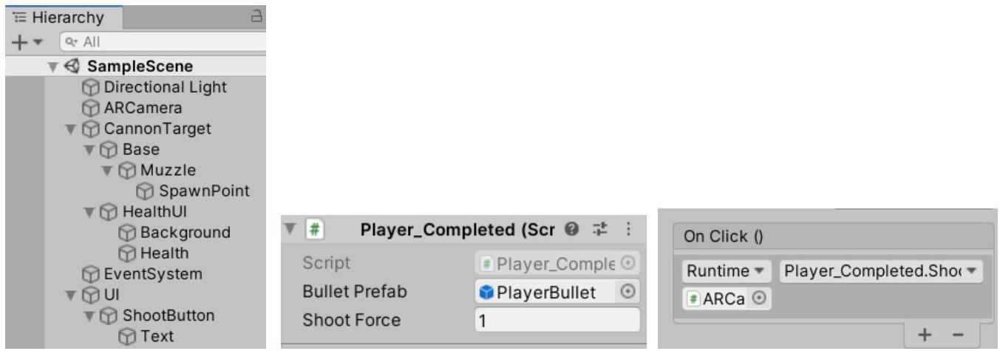

# ARShoot

Create a new license and database in Vuforia or use the existing one and add the images cannon.jpg and robin.png as image targets.

Create a new Unity 3D project add the Vuforia Engine AR package. Delete the Main Camera, add a Vuforia AR Camera and in the Vuforia Configuration increase the Max Simultaneous tracked images to 2.

Note: If you want to build for Android adjust the build settings respectively. Also, here the old Input Manager will be used. If you want, you can change to the new Input System. Both should be familiar from previous labs.

# Creating the cannon

To simulate a cannon model, we will use a sphere for the base and a cylinder for the muzzle. Add a Vuforia  $\rightarrow$  ImageTarget to the Hierarchy. Name it CannonTarget and in the Inspector for the ImageTarget field of the ImageTargetBehaviour Component select the cannon target. Add a 3D Object  $\rightarrow$  Sphere as a child to the CannonTarget and name it Base. Set the scale of the sphere to 0.2 on all axes. Add a 3D Object  $\rightarrow$  Cylinder as a child to the Base and name it Muzzle. Set the cylinder's scale to 0.3 on all axes. Position the cylinder so that on end is partially inside the sphere and make sure it follows the positive z-direction of the sphere (set the muzzle's rotation to 90 degrees along the X-axis). You can test it by rotating the sphere in the Scene window. If you want you can create and assign materials to the objects.

Note: The idea is for the muzzle to be directed at the object that it will be shooting at. But if we use the LookAt method to direct the cylinder it will not be oriented correctly because the  $z$ -axis of the cylinder is at its side and not the top or bottom. So, we add another game object (in this case the sphere, but it could be an empty game object too) to change the pivot of the cylinder. And we will set the sphere's orientation. Because the cylinder is a child of the sphere it will be rotated accordingly but the length of the cylinder must be along the  $z$ -axis of the sphere for it to look like a muzzle.

We will also be shooting at the cannon, so it will be taking damage and we need to visualize this. For the purpose we'll be using UI bound to the cannon, or more correctly – to the image target.

Right click on the CannonTarget game object and select UI  $\rightarrow$  Image. This will automatically add a canvas as a child to the CannonTarget and an Image as child to the Canvas. Rename the Canvas to HealthUI and the Image to Background. Select the HealthUI (Canvas) object and in the Inspector change the Canvas component Render Mode field to World Space. This way the canvas becomes part of the scene instead of being rendered on top of the rendered image. Currently the canvas is very big, as its size was initially adjusted to pixels. In the RectTransform component change the Pos values to  $(0, 0.5, 0)$ , Width to 0.5 and Height to 0.05, set the Scale to  $(1, 1, 1)$ .







Select the Background game object. In the RectTransform adjust its Anchor to stretch horizontally and vertically. To do that click on the square in the top-left corner of the RectTransform and while holding the Alt key press on the bottom-right icon in the menu that pops up. The Anchor specifies how this object's position is aligned according to its parent position. In this way we make the Background fill the HealthUI canvas. Press the button next to the Source Image field and

select the Knob sprite. Change the color to red, the Image Type to Filled, Fill Method to Horizontal, Fill Origin to Right and Fill Amount to 1.

In the Hierarchy right click the Background game object and select Duplicate (or select it and press Ctrl+D). Rename the new game object to Health. Change the Color to green and keep all other settings the same. Try changing the Fill Amount to see the effect.

At any point feel free to enter Play Mode to see how it looks.

# Orienting towards the Camera

Create a new C# script and name it LookAtCamera.cs. Its only function will be to orient the object that it is attached to at the specified camera. We'll also add a look at distance field to determine when this functionality will be active.

Open the LookAtCamera script add a public float ActivateDistance and a public Camera LookAtCam fields. In the Update method add code that checks if the camera is closer than the specified distance, and if so, call the Tranform.LookAt method to orient the object towards the camera. Use a negative value to specify that the object should always look at the camera. The LookAtCamera script:

```cs
using UnityEngine;
public class LookAtCamera_Completed : MonoBehaviour
{
    [Tooltip("The camera to look at")]
    public Camera LookAtCam;
    [Tooltip("Use negative value to always look at the camera")]
    public float LookAtDistance;
    // Update is called once per frame
    void Update()
    {
        if(LookAtDistance &lt; 0 || (transform.position - LookAtCam.transform.position).magnitude &lt; LookAtDistance)
        {
            transform.LookAt(LookAtCam.transform.position, transform.parent.up);
        }
        else
        {
            //when not looking at camera return to zero orientation
            transformRotation = Quaternion identity;
        }
    }
}
```

Add the LookAtCamera script to the HealthUI and Base game objects. Set the Camera fields to the ARCamera and adjust the LookAtDistance values (use negative value for the HealtUI to make it always face the camera).





# Shooting for the cannon

Right click the Muzzle in the Hierarchy and create an empty game object. Rename it to SpawnPoint – this is where the bullets will be spawned when shooting. Place the spawn point at the tip of the muzzle and orient it so that the z-axis is pointing forward (rotate -90 degrees around the x-axis).



Right click the SpawnPoint in the Hierarchy, create a 3D Object  $\rightarrow$  Sphere and name it Bullet. Adjust the scale to shape it as you want (for example (0.5, 0.5, 1)). You might want to change the Collider component to something that better bounds the bullet, for example a capsule (for the sample scale above). Add a Rigidbody component to the bullet. This will allow us to apply force to the bullet to shoot it. Remove the Use Gravity check box, so that gravity doesn't affect the bullet. Drag the Bullet game object from the Hierarchy to the Project window to create a prefab, i.e. a ready configured game object we can instantiate from code. After that delete the Bullet game object from the Hierarchy as we will be instantiating bullets in runtime using the prefab.

Create a new C# script and call it Lifetime. It will be used to destroy a game object (a bullet) automatically after a specific time. Open the script. Add a public float LifeDuration field and set its default value to 3.0f, for example. Add a Coroutine method that destroys the object the script is attached to (using the Destroy method) after the duration has passed – use yield return new WaitForSeconds(LifeDuration) call before the Destroy call. Call the coroutine from the Start method. The LifeDuration script:

```cs
using System.Collections;
using UnityEngine;

public class Lifetime_Completed : MonoBehaviour
{ 
    public float LifeDuration = 3.0f$  

    // Start is called before the first frame update
    void Start()
    { 
        StartCoroutine(DestroyWithDelay(LifeDuration));
    } 
    
    private IEnumerator DestroyWithDelay(float delay)
    { 
        yield return new WaitForSeconds(delay);
        Destroy(gameObject);
    }
}
```

Create also a Bullet C# script with a single public float field for the damage inflicted. If you want, you can add also fields to be able to change the color or other properties of the bullet. The Bullet script:

```cs
using UnityEngine;

public class Bullet_Completed : MonoBehaviour
{
    public float DamageInflicted = 10.0f;
}
```

In Unity double click on the Bullet prefab to open it and attach the Lifetime and Damage scripts to the Bullet game object.

Create a new C# script and call it Cannon. Open the script and add fields for the target, for the shooting distance (how close the camera (or other target) should be for the cannon to start shooting), for the spawn point (of type Transform), where the bullets will be shot from, for the shooting delay, and for the bullet prefab (of type GameObject). You can also add a field for the force applied to the bullet when shooting. Add a Shoot method that will instantiate the bullet prefab

using the GameObject.Instantiate method and add force to the bullet using the Rigidbody component to shoot it forward (the forward direction comes from the spawn point). The Cannon script:

```cs
using System.Collections;
using UnityEngine;
public class Cannon_Completed : MonoBehaviour
{
    public float ShootDistance = 0.2f;
    public float ShootDelay = 2.0f;
    public float ShootForce = 1.0f;
    public Transform Target;
    public Transform SpawnPoint;

    public GameObject BulletPrefab;

    void Start()
    {
        StartCoroutine(ShootingTimer());
    }

    public void Shoot()
    {
        GameObject bullet = Instantiate(BulletPrefab, SpawnPoint);
        bullet.GetComponent<Rigidbody>().AddForce(SpawnPoint.forward * ShootForce, ForceMode.Impulse);
    }

    private IEnumerator ShootingTimer()
    {
        while (true)
        {
            yield return new WaitForSeconds(ShootDelay);
            float distance = (transform.position - Target.position).magnitude;
            //avoid shooting at the beginning when there is no recognized target
            if (distance > 0.1f && distance < ShootDistance)
            {
                Shoot();
            }
        }
    }
}
```

Attach the Cannon script to the Base game object. Drag the ARCamera game object from the Hierarchy on to the Target field, the SpawnPoint game object to the SpawnPoint field and from the Project window drag the Bullet prefab to the BulletPrefab field.



Enter Play Mode to test the current state. When you get closer than  20 cm the cannon should start shooting. You can adjust the fields to your liking.

# Shooting for the player

To allow the player to shoot we'll add a screen space canvas with a button. The player's bullets will be shot from the center of the screen.

Right click in the Hierarchy and choose UI  $\rightarrow$  Canvas, rename the game object to UI, then right click on it and select UI  $\rightarrow$  Button. Change the UI Scale Mode of the CanvasScaler component of the Canvas to Scale With Screen size. Anchor the button to the bottom right and adjust its place. Change the text of the button or add a Sprite (image).

Create a Player C# script and add public fields for the bullet prefab and for the shooting force. Add a public void Shoot method that will instantiate the bullet and shoot it from the center of the screen. The Player script:

```cs
using UnityEngine;
public class Player_Completed : MonoBehaviour
{
    public GameObject BulletPrefab;
    public float ShootForce = 1.0f;

    public void Shoot()
    {
        GameObject bullet = Instantiate(BulletPrefab, transform);
        Ray r = Camera.main.ScreenPointToRay(new Vector3(Screen.width / 2, Screen.height / 2));
        bullet.GetComponent<rigidbody>().AddForce(r.direction * ShootForce, ForceMode.Impulse);
    }
}
```

Attach the Player script to the ARCamera game object. Duplicate the Bullet prefab as PlayerBullet and assign it to the BulletPrefab field of the Player component. Change the scale for the PlayerBullet prefab to (0.01, 0.01, 0.02). This difference in the scale of the bullets is necessary because the bullets for the cannon are children to the Cannon target which has a scale of 0.2 and respectively scales down the cannon bullet. Select the UI button, add an OnClick event handler and assign it the ARCamera game object Player  $\rightarrow$  Shoot method.



# Taking damage (Cannon)

To make the cannon take damage we need to detect when a bullet has collided with it. For the purpose we can use the OnCollisionEnter method. We'll add it to the Cannon class, check if the object that collided has a Bullet component. If yes, the health of the cannon will be reduced and the change reflected on the health bar. For the purpose we'll need also fields for the total and current health of the cannon as well as a reference to the health bar image. The edited Cannon script:

```cs
using System.Collections;
using UnityEngine;
using UnityEngine.UI;
public class Cannon_Completed : MonoBehaviour
{
    public float ShootDistance = 0.2f;
    public float ShootDelay = 2.0f;
    public float ShootForce = 1.0f;
    public Transform Target;
    public Transform SpawnPoint;</rigidbody>

    public GameObject BulletPrefab;

    // new fields for health
    public float TotalHealth = 100.0f;
    private float currentHealth;
    public Image HealthBar;

    void Start()
    {
        StartCoroutine(ShootingTimer());
        currentHealth = TotalHealth;
    }

    public void Shoot()
    {
        GameObject bullet = Instantiate(BulletPrefab, SpawnPoint);
        bullet.GetComponent<rigidbody>().AddForce(SpawnPoint.forward * ShootForce, ForceMode.Impulse);
    }

    private IEnumerator ShootingTimer()
    {
        while (true)
        {
            yield return new WaitForSeconds(ShootDelay);
            float distance = (transform.position - Target.position).magnitude;
            // avoid shooting at the beginning when there is no recognized target
            if (distance &gt; 0.1f &amp;&amp; distance &lt; ShootDistance)
            {
                Shoot();
            }
        }
    }

    private void OnCollisionEnter(Collision collision)
    {
        Bullet_Completed bullet = collision.collider.GetComponent<bullet_completed>();
        if(bullet != null)
        {
            currentHealth -= bullet.DamageInflicted;
            HealthBar.fillAmount = currentHealth / TotalHealth;
            Destroy(bullet.gameObject);
            if(currentHealth &lt;= 0)
            {
                Destroy(this.gameObject);
            }
        }
    }
}
```

## Taking damage (Player)

To make the player take damage too you can make the same changes to the player script. You will also need to add a Collider component to the ARCamera game object to detect when a bullet hits the camera.

To allow the player to see his/her health, add a health bar (two child image game objects) to the UI canvas game object.


