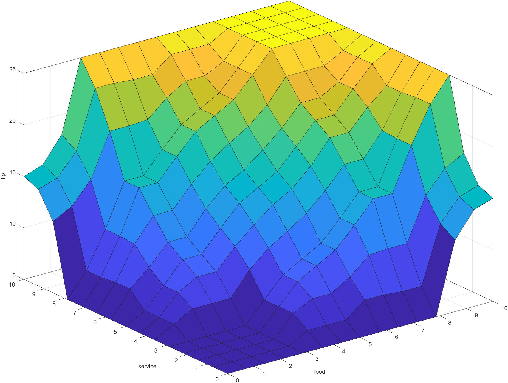
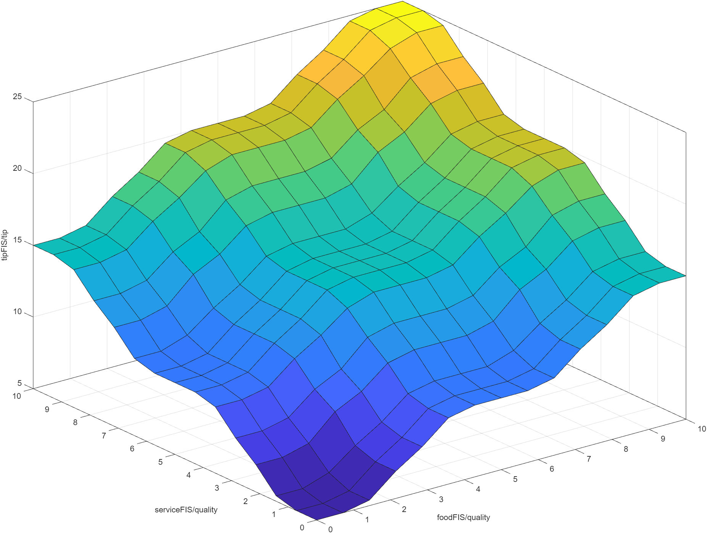
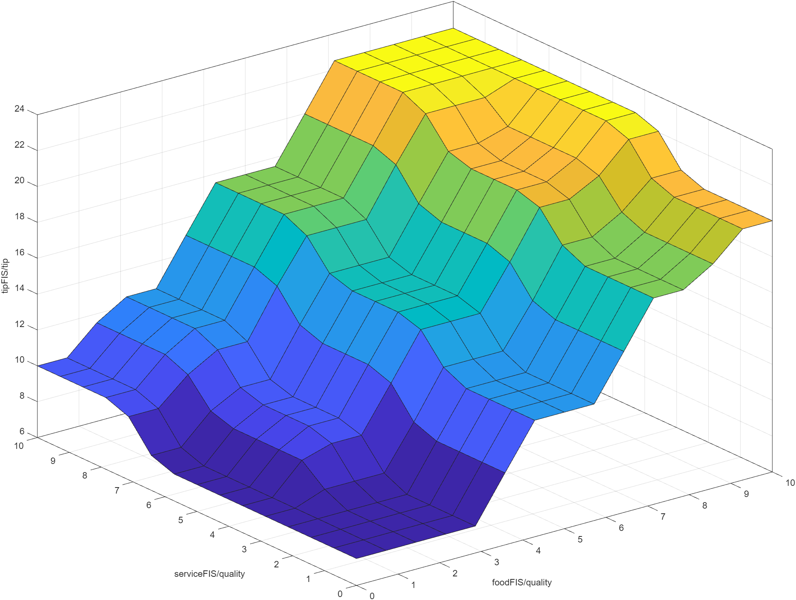
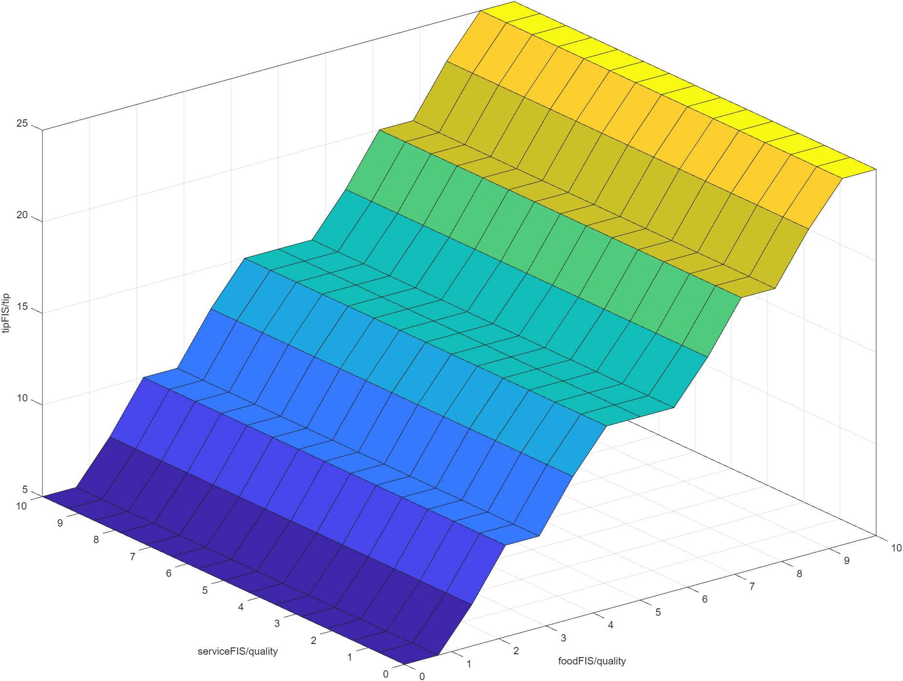

# [Exercise 2](https://www.mathworks.com/help/fuzzy/build-fis-tree-using-fuzzy-logic-designer.html)

### [Final](weightedTipper.mat)

### [Quality of Food and Service](weightedTipper.mat)

### [Leaning to Food Quality, set to 0.75](weightedTipper.mat)

### [Dependable only on Quality](weightedTipper.mat)

