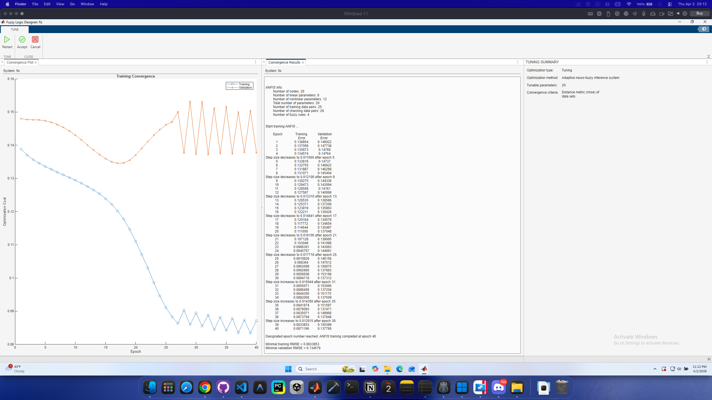
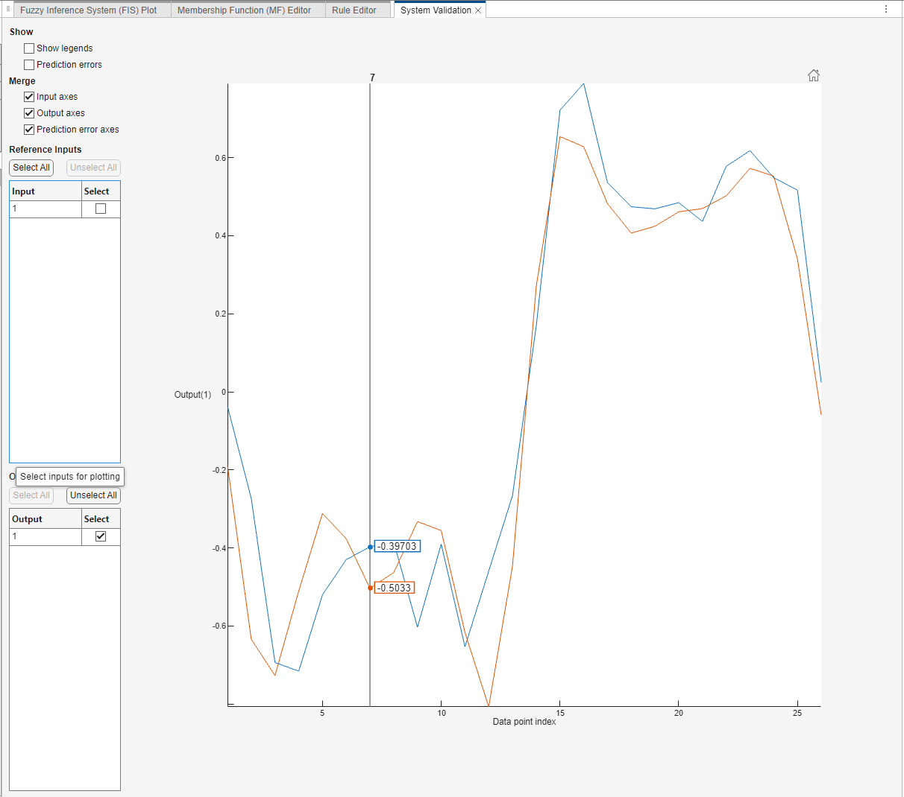

# [Exercise 3](https://www.mathworks.com/help/fuzzy/train-adaptive-neuro-fuzzy-inference-systems-gui.html)

### [Tune](fis_tuned.fis)

### [System Validation](fis_tuned.fis)

### [Tune 2](fis_tuned_1.fis)

### [System Validation 2](fis_tuned_1.fis)

